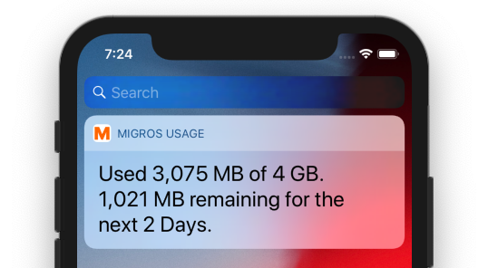

#  M-Usage

I needed a way to check how much data left on my Migros data plan.

## TODO
- [x] Fix Widet on different font sizes (accessibility)
- [x] Fix incorrect error messages
- [x] Translate widget
- [x] Add instructions how to add widget https://support.apple.com/de-de/HT207122
- [x] check if you can improve loading times -> not possible
- [x] add gauge
- [x] move account button to the bottom
- [x] Make text font accessible (Scaling Fonts)
- [x] remove padding in today widget
- [x] test big font size with widget, request more widget space if front is big
- [x] handle connection error in main app
- [ ] investigate why the widget sometimes starts with an error message

## Notes
* It just logs into the users profile page and grabs the infos from HTML, maybe you can use the code for your own app?
* Today Widget uses the Notifications icon
* Logging into migros care requires auth token, and then gives you 2 redirects.
